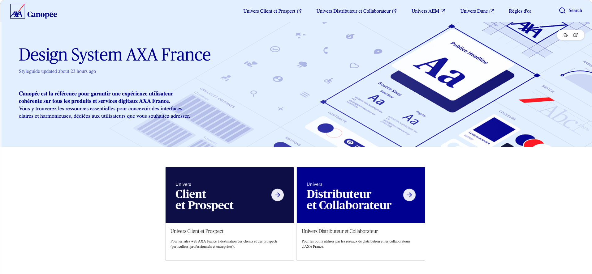
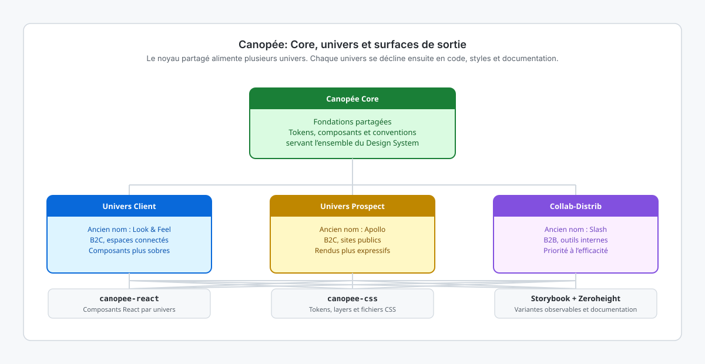
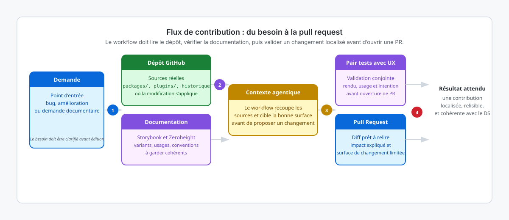

<!-- page-journey: all -->
<!-- page-adventure: core -->

# Contexte : Design System AXA France Canopée

> _Utilisez cette page comme contexte de référence avant de créer des workflows sur le dépôt du Design System. Elle résume le périmètre produit, l’architecture, les thèmes, les conventions de contribution et les points d’intégration utiles aux agents._

<picture>
    <source media="(prefers-color-scheme: dark)" srcset="images/hero.png">
    <source media="(prefers-color-scheme: light)" srcset="images/hero.png">
    
</picture>

## 🎯 Ce que cette page vous apporte

Dans cet atelier, les workflows seront conçus pour intervenir sur le Design System AXA France **Canopée**. Avant d’automatiser des tâches de revue, de génération ou de maintenance, il faut comprendre ce que contient ce dépôt, comment les thèmes sont organisés et où se trouvent les surfaces de contribution importantes.

À la fin de cette page, vous saurez :

- identifier les trois univers produits et leur rôle ;
- repérer les principaux packages et leur responsabilité ;
- comprendre comment les thèmes, tokens et composants sont structurés ;
- choisir où intervenir pour une contribution ou un workflow agentique ;
- relier le dépôt à ses sources de documentation et à ses serveurs MCP.

## Vue d’ensemble

Canopée est le Design System d’AXA France. Il sert de socle commun pour construire des interfaces cohérentes sur plusieurs produits, avec une base de composants partagés, des styles spécialisés par univers métier et une documentation de référence destinée aux équipes design et front-end.

Le dépôt ne sert pas uniquement à publier des composants UI. Il joue aussi plusieurs rôles à la fois :

- bibliothèque de composants React ;
- bibliothèque CSS consommable sans React ;
- espace de maintenance des tokens et des styles par univers ;
- point d’entrée pour la documentation Storybook et Zeroheight ;
- surface de contribution où les changements doivent rester cohérents d’un univers à l’autre.

## Les trois univers

Le Design System est organisé autour de trois univers principaux. Ils partagent une base commune, mais chacun sert un contexte d’usage différent.

| Univers        | Ancien nom  | Cible principale | Usage typique                           | Storybook                                                                                    |
| -------------- | ----------- | ---------------- | --------------------------------------- | -------------------------------------------------------------------------------------------- |
| Client         | Look & Feel | B2C              | Espaces connectés et parcours client    | [Storybook Client](https://axafrance.github.io/design-system/client/react/next/)             |
| Prospect       | Apollo      | B2C              | Sites publics et parcours d’acquisition | [Storybook Prospect](https://axafrance.github.io/design-system/prospect/react/next/)         |
| Collab-Distrib | Slash       | B2B              | Applications internes et distribution   | [Storybook Distributeur](https://axafrance.github.io/design-system/distributeur/react/next/) |

Le schéma ci-dessous résume la relation entre la base Canopée, les univers et les surfaces de sortie les plus visibles.

<picture>
    <source media="(prefers-color-scheme: dark)" srcset="images/000-design-system-map-dark.svg">
    <source media="(prefers-color-scheme: light)" srcset="images/000-design-system-map-light.svg">
    
</picture>

### Ce que cela implique pour un workflow

Un workflow agentique qui agit sur ce dépôt doit presque toujours répondre à l’une de ces questions avant de modifier quoi que ce soit :

- le changement concerne-t-il un seul univers ou plusieurs ;
- la modification touche-t-elle du React, du CSS, ou les deux ;
- la documentation de l’univers doit-elle être mise à jour en même temps que le code ;
- le changement relève-t-il d’un composant, d’un token, d’un pattern de contribution, ou d’un outillage.

## Architecture du dépôt

À haut niveau, le dépôt sépare les responsabilités entre packages réutilisables et plugins de connaissance pour les agents.

```text
design-system/
├── packages/
│   ├── canopee-css/
│   │   └── src/
│   │       ├── distributeur/
│   │       └── prospect-client/
│   └── canopee-react/
│       └── src/
│           ├── distributeur/
│           └── prospect-client/
└── plugins/
        ├── canopee-distributeur/
        └── canopee-prospect-client/
```

### Lecture rapide de cette structure

- `packages/canopee-react/` contient les composants React prêts à être consommés par les applications.
- `packages/canopee-css/` expose les styles sous forme de fichiers CSS pour des usages sans React ou pour une consommation plus fine.
- `prospect-client/` mutualise une partie des sources pour les univers B2C, tout en permettant des variantes visuelles distinctes.
- `distributeur/` isole les besoins B2B lorsque les patterns et styles divergent davantage.
- `plugins/` regroupe les surfaces pensées pour enrichir le contexte d’un agent ou d’un assistant avec des conventions du Design System.

## Fondations, thèmes et composants

Les composants Canopée reposent sur des fondations de design qui doivent rester stables lorsqu’un workflow propose un changement.

### Fondations à connaître

- grille et règles de layout ;
- typographie et hiérarchie visuelle ;
- tokens de couleur, d’espacement et de rayon ;
- conventions d’icônes et d’illustration ;
- styles transverses utilisés par plusieurs composants.

### Composants récurrents

Sans chercher l’exhaustivité, un workflow sur ce dépôt rencontrera souvent des familles comme :

- boutons et actions ;
- cartes et blocs de contenu ;
- formulaires et champs ;
- header, footer et navigation ;
- listes, séparateurs et patterns de structure ;
- composants spécialisés de contenu ou d’assistance.

### Pourquoi les thèmes comptent

Un composant peut exister dans plusieurs univers tout en conservant une API proche, mais son rendu, ses couleurs ou certains détails d’implémentation varient selon le thème. Cela signifie qu’un workflow qui propose une modification visuelle ne peut pas supposer qu’un changement sur Prospect se transpose à l’identique sur Client ou Collab-Distrib.

## Exemple utile : le composant Button

Le composant `Button` est un bon exemple de divergence contrôlée entre univers.

| Univers        | Intention visuelle                                   | Variantes notables                                              |
| -------------- | ---------------------------------------------------- | --------------------------------------------------------------- |
| Prospect       | Plus marketing, plus expressif, souvent plus arrondi | `primary`, `primary-business`, `secondary`, variantes inversées |
| Client         | Plus sobre, plus direct, plus utilitaire             | `primary`, `primary-business`, `secondary`, variantes inversées |
| Collab-Distrib | Plus fonctionnel, orienté efficacité métier          | `primary`, variantes adaptées aux outils internes               |

Exemples d’imports par univers :

```tsx
import { Button } from '@axa-fr/canopee-react/prospect';
```

```tsx
import { Button } from '@axa-fr/canopee-react/client';
```

```tsx
import { Button } from '@axa-fr/canopee-react/distributeur';
```

Exemples côté CSS :

```css
@import '@axa-fr/canopee-css/prospect/common/tokens.css';
@import '@axa-fr/canopee-css/client/common/tokens.css';
@import '@axa-fr/canopee-css/distributeur/common/tokens.css';
```

## Personnalisation et CSS layers

Canopée s’appuie sur des CSS layers pour mieux contrôler l’ordre de cascade et limiter les conflits de spécificité.

```css
@layer reset;
@layer canopee;
```

L’idée à retenir pour l’atelier est simple : lorsqu’un workflow modifie un style ou propose une surcharge, il doit vérifier dans quel layer et dans quel univers le changement s’applique réellement. Une correction purement locale dans une application consommatrice n’a pas la même portée qu’une modification du layer du Design System lui-même.

## Installation et consommation

Le dépôt publie deux familles de packages principales :

- `@axa-fr/canopee-react` pour les composants React ;
- `@axa-fr/canopee-css` pour les feuilles de style.

Installation des versions stables :

```bash
npm install @axa-fr/canopee-react@latest @axa-fr/canopee-css@latest
```

Installation de la prochaine version publiée :

```bash
npm install @axa-fr/canopee-react@next @axa-fr/canopee-css@next
```

> [!NOTE]
> Les anciens packages historiques liés à Apollo, Slash ou Look & Feel sont en transition. Pour les workflows de cet atelier, considérez `@axa-fr/canopee-react` et `@axa-fr/canopee-css` comme les points d’entrée de référence.

## Documentation et sources de vérité

Quand un agent doit vérifier un comportement attendu, il ne doit pas se limiter au code source. Dans ce contexte, plusieurs sources peuvent faire autorité selon la question :

| Source            | Sert surtout à                               | Quand la consulter                                                |
| ----------------- | -------------------------------------------- | ----------------------------------------------------------------- |
| Repository GitHub | Implémentation réelle, historique, structure | Pour modifier du code, ouvrir une PR, lire les sources            |
| Storybook         | État observable des composants et variantes  | Pour comparer un rendu ou vérifier une API visible                |
| Zeroheight        | Documentation design et patterns d’usage     | Pour comprendre l’intention produit et les règles d’usage         |
| Guides du dépôt   | Processus, migration, contribution           | Pour préparer une contribution ou interpréter une règle de projet |

## MCP et documentation agentique

Canopée expose aussi un contexte utile pour les agents via MCP. L’objectif n’est pas de remplacer le code source, mais de donner un accès structuré à la documentation afin que les workflows et assistants puissent raisonner avec moins d’ambiguïté.

Cas d’usage typiques :

- retrouver la page de documentation d’un composant ;
- comparer le nom d’un univers et son périmètre ;
- valider l’existence d’un pattern avant de proposer du code ;
- guider un agent vers la bonne terminologie et les bons packages.

Exemple de configuration MCP :

```json
{
    "servers": {
        "univers-client-et-prospect": {
            "type": "http",
            "url": "https://mcp.zeroheight.com/mcp/1bb166a348d406a4d73ddb61365533daff859566"
        },
        "univers-distributeur-et-collaborateur": {
            "type": "http",
            "url": "https://mcp.zeroheight.com/mcp/588d276aca51f9bf6066fb5f253c909733e6e2b8"
        }
    },
    "inputs": []
}
```

Le schéma ci-dessous montre comment un agent peut croiser le dépôt, la documentation et le contexte MCP avant de proposer une modification.

<picture>
    <source media="(prefers-color-scheme: dark)" srcset="images/000-design-system-contribution-flow-dark.svg">
    <source media="(prefers-color-scheme: light)" srcset="images/000-design-system-contribution-flow-light.svg">
    
</picture>

## Contribuer au dépôt

Le Design System est un dépôt partagé. Une bonne contribution ne consiste pas seulement à corriger un fichier : elle doit préserver la cohérence entre univers, composants, documentation et conventions d’équipe.

### Boucle de contribution typique

1. identifier le besoin exact ;
2. localiser le bon univers, package et niveau d’abstraction ;
3. faire une modification minimale ;
4. vérifier le rendu, les tests et le build ;
5. soumettre une pull request argumentée ;
6. intégrer les retours de revue avant publication.

### Conventions de commit

Le dépôt utilise une convention de type Conventional Commits avec des scopes alignés sur le Design System.

```text
<type>[scope]: <description>
```

Scopes courants :

| Scope           | Usage                                          |
| --------------- | ---------------------------------------------- |
| `prospect`      | Thème Prospect                                 |
| `client`        | Thème Client                                   |
| `distributeur`  | Thème Collab-Distrib                           |
| `canopee`       | Changement transverse Design System            |
| `design-system` | Changement plus global de dépôt ou d’outillage |

Exemples :

```text
feat(canopee): ajout d'un nouveau composant
fix(prospect): corrige le style du bouton secondaire
chore(design-system): met à jour l'outillage de build
```

### Ce qu’un workflow doit préserver

Quand vous créerez des workflows pour ce dépôt dans l’atelier, ils devront éviter plusieurs erreurs classiques :

- modifier un univers sans vérifier l’impact sur les autres ;
- changer du code sans vérifier la documentation ou le Storybook ;
- proposer des corrections trop larges alors qu’une surface plus locale existe ;
- ignorer les conventions de commit, de revue ou de build du dépôt ;
- traiter un problème de thème comme s’il s’agissait d’un problème de logique métier.

## Commandes utiles dans le dépôt

Les commandes exactes dépendront du projet et de sa configuration courante, mais la forme générale attendue dans le contexte de ce Design System ressemble à ceci :

```bash
npm run dev
npm run build
```

Selon les univers ou sous-projets, des variantes ciblées peuvent exister pour lancer ou builder uniquement une partie du Design System.

## Ce que cela change pour l’atelier

Cette page donne le contexte nécessaire pour construire des workflows plus pertinents sur Canopée. Dans les étapes suivantes, les agents ne travailleront pas sur un dépôt générique, mais sur un système composé : plusieurs univers, plusieurs surfaces de publication, plusieurs sources de vérité et des conventions de contribution à respecter.

Un bon workflow sur ce dépôt devra donc souvent savoir faire trois choses à la fois :

- comprendre où chercher l’information ;
- limiter son action à la bonne surface ;
- expliquer clairement pourquoi un changement est sûr et cohérent.

## :white_check_mark: Checkpoint

- [ ] Vous savez nommer les trois univers Canopée et leur rôle principal
- [ ] Vous savez distinguer `canopee-react`, `canopee-css` et `plugins/`
- [ ] Vous comprenez qu’un changement peut devoir être raisonné par univers et par thème
- [ ] Vous savez quelles sources consulter entre dépôt, Storybook et Zeroheight
- [ ] Vous savez quelles contraintes un workflow devra respecter pour contribuer proprement au Design System

<!-- journey: all -->

**Étape suivante :** [Bienvenue — ce que vous allez construire](00-welcome.md)

<!-- /journey -->
