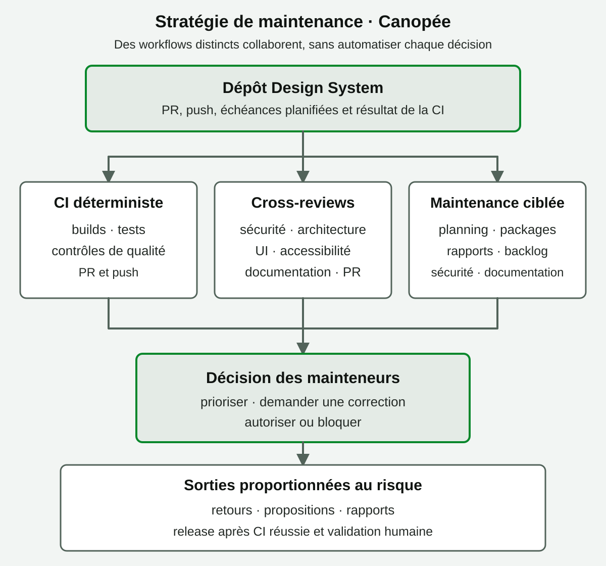

<!-- page-journey: all -->
<!-- page-adventure: core -->

# Des exercices à une stratégie de maintenance

Les workflows que vous construisez dans cet atelier s’appuient sur des exemples : un rapport quotidien, une revue de pull request ou l’ajout d’outils à un agent. Ils servent à apprendre les mécanismes des Agentic Workflows, pas à définir à eux seuls la stratégie du dépôt.

Le dépôt [AXA France Design System](https://github.com/AxaFrance/design-system) réunit plusieurs packages, univers, composants et sources de documentation. L’objectif à terme est de réfléchir à un ensemble cohérent de workflows qui aide à maintenir tout le dépôt, tout en laissant les décisions importantes aux personnes qui en sont responsables.

<picture>
  <source media="(max-width: 767px) and (prefers-color-scheme: dark)" srcset="images/0.5-maintenance-map-mobile-dark.svg">
  <source media="(max-width: 767px) and (prefers-color-scheme: light)" srcset="images/0.5-maintenance-map-mobile-light.svg">
  <source media="(prefers-color-scheme: dark)" srcset="images/0.5-maintenance-map-dark.svg">
  <source media="(prefers-color-scheme: light)" srcset="images/0.5-maintenance-map-light.svg">
  
</picture>

_Les flèches représentent des parcours complémentaires : chaque événement déclenche les contrôles pertinents, et une release reste conditionnée par la réussite de la CI et la validation des mainteneurs._

## Partir des besoins du dépôt

Avant de choisir un trigger ou un modèle, demandez-vous où l’équipe perd du temps, quelles erreurs elle veut prévenir et quelles tâches reposent sur un jugement humain. Une stratégie utile couvre les activités réellement nécessaires au dépôt ; elle n’essaie pas de rendre chaque tâche agentique.

Les exemples déjà explorés dans le dépôt peuvent servir de matière à réflexion. Parcourez les [workflows existants](https://github.com/AxaFrance/design-system/tree/main/.github/workflows), puis évaluez-les selon les besoins, les risques et les responsabilités de votre équipe.

## Une carte possible de la maintenance

Ces axes reprennent des pratiques courantes des dépôts open source et plusieurs prototypes du Design System. Ce sont des pistes à discuter et à adapter, pas une architecture à reproduire telle quelle.

### Qualité et intégration continue

- **Besoin :** détecter tôt les régressions dans les packages, les tests et les builds.
- **Approche possible :** garder les vérifications répétables dans des workflows déterministes déclenchés par pull request ou push.
- **Question à poser :** quels contrôles sont obligatoires avant qu’un changement puisse être fusionné ?

### Revues croisées et spécialisées

- **Besoin :** examiner un changement sous plusieurs angles qui demandent des expertises différentes.
- **Approche possible :** déclencher des cross-reviews ciblées, par exemple sécurité, architecture technique, UI/accessibilité ou cohérence de la documentation. Les prototypes du dépôt montrent déjà ces profils de revue.
- **Question à poser :** quelles remarques peuvent être proposées automatiquement, et lesquelles doivent rester une décision humaine ? Une approbation automatique est un choix de gouvernance à évaluer, pas un réglage par défaut.

### Documentation et connaissances du projet

- **Besoin :** éviter que les exemples, les API documentées et les consignes de contribution divergent du code.
- **Approche possible :** repérer les changements concernés, proposer une mise à jour et ouvrir une pull request pour relecture.
- **Question à poser :** quelles sources font autorité pour chaque univers, package ou composant ?

### Dépendances, sécurité et santé du dépôt

- **Besoin :** suivre les mises à jour, les alertes et les travaux qui risquent de rester sans réponse.
- **Approche possible :** combiner les alertes et contrôles déterministes avec des rapports ou du triage assisté, en limitant les actions d’écriture.
- **Question à poser :** quelles tâches peuvent être classées ou proposées par un agent, et lesquelles nécessitent une validation avant toute action ?

### Releases et communication

- **Besoin :** publier des versions cohérentes, traçables et accompagnées d’informations utiles aux utilisateurs.
- **Approche possible :** préparer les notes ou une proposition de release après le succès de la CI, avec une validation adaptée au niveau de risque.
- **Question à poser :** qui choisit la version, vérifie les changements incompatibles et autorise la publication ?

## Décider quoi automatiser

Pour chaque idée de workflow, vous pouvez vous poser ces questions :

1. Le résultat attendu est-il suffisamment clair pour être vérifié ?
2. La tâche est-elle répétable, ou exige-t-elle un jugement sur le contexte du dépôt ?
3. Quelles données l’agent doit-il lire, et quelles permissions lui sont réellement nécessaires ?
4. Peut-il seulement signaler ou proposer un changement, ou peut-il aussi l’appliquer ?
5. Quel contrôle déterministe et quelle personne gardent la responsabilité de la décision ?
6. Comment saurez-vous, après plusieurs exécutions, que le workflow aide réellement l’équipe ?

Un bon point de départ consiste à laisser les contrôles prévisibles à la CI, à utiliser l’agent pour analyser et formuler des propositions, puis à choisir explicitement les cas où une action automatique est acceptable. Faites évoluer cette répartition à partir des résultats et des retours de l’équipe.

## Ce que vous allez construire dans cet atelier

Le parcours utilise un rapport quotidien comme fil conducteur pour apprendre à créer, compiler, exécuter et améliorer un Agentic Workflow. Les étapes suivantes réutilisent ces bases pour explorer d’autres patterns, notamment les workflows déclenchés par événement et les revues de pull request.

À chaque exercice, demandez-vous comment le pattern pourrait s’intégrer à une stratégie plus large pour le Design System, ce qu’il ne couvre pas et quelles garanties seraient nécessaires avant de l’utiliser dans le dépôt réel.

## ✅ Checkpoint

- [ ] Je comprends que les workflows de l’atelier sont des exemples pour apprendre, pas une stratégie complète imposée au dépôt
- [ ] Je peux citer plusieurs besoins de maintenance du Design System auxquels des workflows pourraient répondre
- [ ] Je distingue les contrôles déterministes, l’analyse agentique, les propositions et les actions automatiques
- [ ] Je sais qu’une cross-review peut apporter plusieurs expertises et que son niveau d’autonomie doit être choisi
- [ ] Je suis prêt à découvrir le résultat concret que je vais construire dans [Bienvenue](00-welcome.md)

<!-- journey: all -->

**Étape suivante :** [Bienvenue — ce que vous allez construire](00-welcome.md)

<!-- /journey -->
