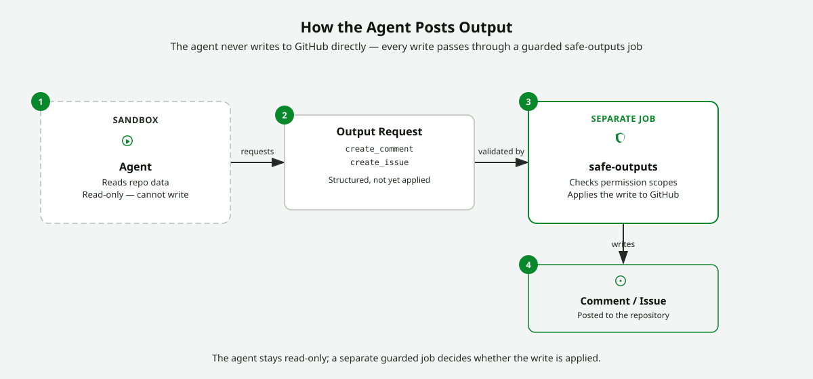

<!-- page-journey: all -->
<!-- page-adventure: side-quest -->

# Side Quest : La structure à deux fichiers

> _Facultatif : faites cette side quest après [Que sont les agentic workflows ?](05-agentic-workflows-intro.md) pour comprendre la relation entre les fichiers source `.md` et les [lock files](https://github.github.com/gh-aw/reference/glossary/#workflow-lock-file-lockyml) `.lock.yml`, et pour vérifier votre vocabulaire._

## 📋 Avant de commencer

- Vous avez lu [Que sont les agentic workflows ?](05-agentic-workflows-intro.md)

## Les deux fichiers

Un [agentic workflow](https://github.github.com/gh-aw/introduction/overview/#what-are-agentic-workflows) comporte deux fichiers placés dans `.github/workflows/` :

| Fichier      | Ce que c’est                                                                                       | Qui l’écrit     |
| ------------ | -------------------------------------------------------------------------------------------------- | --------------- |
| `.md` source | Votre brief de tâche plus le [frontmatter](https://github.github.com/gh-aw/reference/frontmatter/) | Vous            |
| `.lock.yml`  | Le YAML compilé qu’exécute GitHub Actions                                                          | `gh aw compile` |

**Ne modifiez jamais `.lock.yml` à la main** ; régénérez-le avec `gh aw compile` après chaque changement du fichier `.md`.

Le diagramme ci-dessous montre leur relation :

<picture>
   <source media="(prefers-color-scheme: dark)" srcset="images/05b-two-file-structure-dark.svg">
   <source media="(prefers-color-scheme: light)" srcset="images/05b-two-file-structure-light.svg">
  
</picture>

## Lire un exemple de fichier source `.md`

Voici un fichier source `.md` complet :

```markdown
---
on:
    schedule: daily
permissions:
    issues: read
---

Review all open issues, summarize the key themes, and post a short digest as a new issue.
```

Regardez l’exemple et répondez : quelle partie correspond au **task brief**, et quelle partie indique à GitHub Actions **quand s’exécuter** ?

<details>
<summary>Vérifier votre réponse</summary>

- **Task brief :** le paragraphe après le délimiteur fermant `---`, c’est-à-dire l’instruction en anglais courant destinée à l’agent.
- **When to run :** le bloc `on:` du frontmatter, ici `schedule: daily`.

Le frontmatter est du YAML Actions. Le corps situé en dessous correspond à votre prompt d’agent.

</details>

> [!NOTE]
> `schedule: daily` est un raccourci souple. `gh aw compile` le convertit en expression cron standard Actions ; vous n’écrivez jamais directement une syntaxe cron brute dans un fichier `.md` d’agentic workflow.

## Ce que génère `gh aw compile`

Après avoir exécuté `gh aw compile`, l’outil crée un `.lock.yml` :

```yaml
# Auto-generated by gh aw compile. Do not edit by hand.
name: Review open issues
on:
    schedule:
        - cron: '0 8 * * *'
    workflow_dispatch:
permissions:
    issues: read
```

**Essayez :** exécutez `gh aw compile` dans le terminal de votre Codespace et ouvrez le `.lock.yml` généré. Trouvez la valeur `cron:` et comparez-la à `schedule: daily` dans votre source `.md`.

## Vérifiez votre vocabulaire

Avant de révéler les réponses ci-dessous, écrivez une définition en une phrase pour chaque terme :

- Lock file
- Engine
- `workflow_dispatch`

<details>
<summary>Vérifier vos réponses</summary>

| Terme                                                                                       | Signification en langage simple                                                                 |
| ------------------------------------------------------------------------------------------- | ----------------------------------------------------------------------------------------------- |
| [Lock file](https://github.github.com/gh-aw/reference/glossary/#workflow-lock-file-lockyml) | Le YAML compilé que GitHub Actions exécute réellement ; ne le modifiez jamais à la main         |
| [Engine](https://github.github.com/gh-aw/reference/engines/)                                | Le fournisseur de modèle d’IA (par exemple GitHub Copilot) utilisé par le workflow              |
| `workflow_dispatch`                                                                         | Un déclencheur manuel ; vous lancez l’exécution en cliquant sur un bouton dans l’onglet Actions |

</details>

## Comment l’agent publie sa sortie

Un agent opère toujours en **read-only**. Toute écriture, comme publier un commentaire ou créer une issue, passe par les [safe outputs](https://github.github.com/gh-aw/reference/safe-outputs/) et leurs garde-fous.

<picture>
   <source media="(prefers-color-scheme: dark)" srcset="images/05b-agent-safe-output-flow-dark.svg">
   <source media="(prefers-color-scheme: light)" srcset="images/05b-agent-safe-output-flow-light.svg">
   
</picture>

**Essayez :** ouvrez le `.lock.yml` que vous avez compilé plus tôt. Trouvez le step ou le job qui gère la sortie de l’agent. Notez comment l’écriture est séparée du travail en read-only de l’agent.

> [!TIP]
> Si vous voulez davantage d’entraînement pour distinguer agentic workflows et workflows standard, revenez à [Side Quest : Classer les agentic workflows et les workflows standards](side-quest-05-02-aw-deep-dive.md).

---

Revenez à l’aventure principale : [Que sont les agentic workflows ?](05-agentic-workflows-intro.md).

## ✅ Checkpoint

- [ ] Vous savez repérer le task brief et le trigger dans un exemple de fichier `.md`
- [ ] Vous savez décrire la différence entre le source `.md` et le `.lock.yml` compilé
- [ ] Vous savez définir : lock file, engine et `workflow_dispatch`
- [ ] Vous savez que les agents sont en read-only et que les écritures passent par les [safe outputs](https://github.github.com/gh-aw/reference/safe-outputs/)
